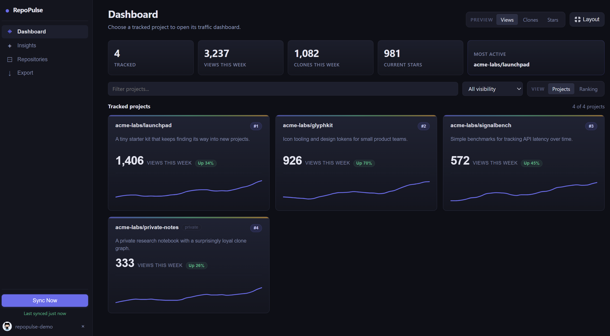
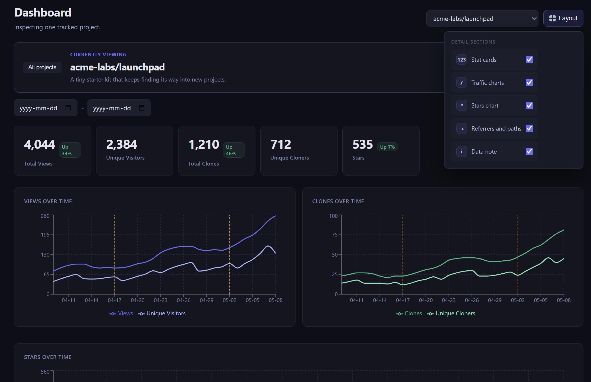

# RepoPulse

**Own your GitHub repo analytics before they disappear.**

GitHub only keeps repository traffic for a short rolling window. RepoPulse quietly snapshots your views, clones, referrers, popular paths, releases, and stars into a local SQLite database so your project history keeps growing instead of evaporating.

No SaaS account. No hosted backend. No Docker required. Your data stays on your machine, or on a Raspberry Pi tucked in a drawer doing the collecting for you.



<p align="center">
  
</p>

## Why RepoPulse?

If you build projects and move on, GitHub's built-in traffic page is easy to forget until the numbers are already gone. RepoPulse is for solo builders, students, maintainers, and small teams who want a long-term memory of what people actually looked at, cloned, released, or found through search and links.

RepoPulse gives you:

- A desktop dashboard for tracked repositories
- Portfolio totals across your projects
- Per-repo traffic charts with release markers
- Star history over time
- Top referrers and popular paths
- Rule-based insights for spikes, dips, release impact, and quiet repos
- JSON, CSV, and Markdown export
- A headless CLI collector for Raspberry Pi or any Linux box

## Features

### Local-First Desktop Dashboard

RepoPulse is a Tauri v2 desktop app for Windows, macOS, and Linux. It stores everything in SQLite and talks to GitHub directly from your machine.

- Track any repository where your token has access
- See views, unique visitors, clones, unique cloners, and stars
- Filter by date range
- Open a project overview or drill into a repo
- Customize which dashboard sections stay visible
- Export backups and reports without uploading data anywhere

### Portfolio Pulse

The dashboard starts with a lightweight portfolio view:

- Total tracked projects
- Views and clones this week
- Current stars across tracked repos
- Most active repo
- Project cards with mini chart previews
- Optional popularity ranking by pulse, views, clones, or stars

### Raspberry Pi Collector

RepoPulse can also run without the desktop UI. Install the CLI on a Raspberry Pi, track repos over SSH, and let systemd keep it syncing every few hours.

That means your laptop does not need to be open for RepoPulse to preserve traffic history.

## Tech Stack

- **Desktop:** Tauri v2
- **Frontend:** React, TypeScript, Vite, Recharts
- **Backend:** Rust, rusqlite, reqwest, chrono, keyring
- **Storage:** SQLite, local only
- **CLI:** Rust binary sharing the same core sync engine

## Quick Start

```bash
git clone https://github.com/exie1122/repopulse
cd repopulse
pnpm install
pnpm tauri dev
```

For a production desktop build:

```bash
pnpm tauri build
```

The app bundle appears under `src-tauri/target/release/bundle/`.

## GitHub Auth

RepoPulse supports two auth paths:

### Personal Access Token

The easiest setup is a GitHub personal access token with access to the repositories you want to track. For private repos and traffic endpoints, GitHub requires appropriate repository access.

The desktop app stores the token in the OS keychain. The CLI can read it from the keychain or from an environment variable:

```bash
export REPOPULSE_GITHUB_TOKEN="ghp_your_token_here"
```

`GITHUB_TOKEN` also works.

### OAuth Device Flow

OAuth Device Flow is available if you provide a GitHub OAuth App client ID:

```bash
export REPOPULSE_GITHUB_CLIENT_ID="your_client_id"
```

For packaged builds, you can set `DEFAULT_GITHUB_CLIENT_ID` in `crates/core/src/oauth.rs` before building. A PAT remains the simplest path for local and Raspberry Pi use.

## CLI

Build the CLI:

```bash
cargo build -p repopulse-cli --release
```

Common commands:

```bash
repopulse track owner/repo
repopulse untrack owner/repo
repopulse sync
repopulse daemon --interval-minutes 240
repopulse status
repopulse list-repos
repopulse export
repopulse export --format csv --repo owner/repo
```

Use a custom SQLite path:

```bash
repopulse --db /var/lib/repopulse/repopulse.db sync
```

## Raspberry Pi Setup

For the simple path, clone RepoPulse on the Pi and run the installer:

```bash
git clone https://github.com/exie1122/repopulse
cd repopulse
./installer
```

The installer prompts for your GitHub token without showing it on screen, asks which repos to track, builds the CLI, writes `/etc/repopulse.env`, installs the systemd service, and starts the collector.

If you want the one-line version:

```bash
./installer ghp_your_token owner/repo another-owner/another-repo
```

Passing a token as an argument is convenient, but it may be saved in shell history. The safer version is:

```bash
./installer
```

You can also set the token through an environment variable:

```bash
REPOPULSE_GITHUB_TOKEN=ghp_your_token ./installer owner/repo
```

After install:

```bash
repopulse --db /var/lib/repopulse/repopulse.db status
systemctl status repopulse
sudo journalctl -u repopulse -f
```

By default the installer stores data at `/var/lib/repopulse/repopulse.db` and syncs every 4 hours. Change the interval with:

```bash
./installer --interval-minutes 120
```

## Data Location

Default desktop database paths:

| Platform | Path |
| --- | --- |
| Windows | `%APPDATA%\com.repopulse.app\repopulse.db` |
| macOS | `~/Library/Application Support/com.repopulse.app/repopulse.db` |
| Linux | `~/.local/share/com.repopulse.app/repopulse.db` |

The CLI can use the same database or any path passed with `--db`.

## GitHub Limits

- GitHub traffic endpoints only expose recent traffic data.
- RepoPulse cannot recover traffic from before you started syncing.
- Traffic endpoints require push access to the repository.
- Referrers and popular paths are stored as latest snapshots; views, clones, stars, and releases accumulate over time.

## Development

```bash
pnpm install
pnpm build
cargo check --workspace
cargo test --workspace
```

Run the desktop app:

```bash
pnpm tauri dev
```

Run screenshot/demo mode in a browser:

```bash
pnpm demo
```

Demo mode uses polished sample repositories and traffic history instead of Tauri IPC, so it is safe for README screenshots and does not expose your real GitHub data.

Project layout:

```text
crates/core/   Rust sync, DB, GitHub API, insights, auth
crates/cli/    Headless CLI and Raspberry Pi collector
src-tauri/     Tauri desktop shell and IPC commands
src/           React dashboard
packaging/     systemd example service
```

## Privacy

RepoPulse does not run a server and does not send your analytics anywhere except GitHub API requests made with your token. Exports are local files. The database is yours.

## License

MIT
